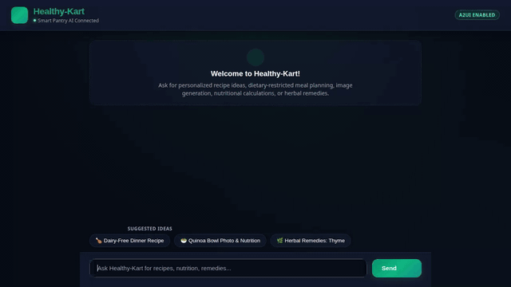

# 🛒 Healthy-Kart (Smart Pantry Chef Agent)



Healthy-Kart is an AI-powered culinary and dietary assistant built on Google Cloud Vertex AI Agent Engine using Google's Agent Development Kit (ADK). It provides personalized recipe recommendations, dietary allergy enforcement, nutritional macro analysis, traditional herbal lookup, generative dish media, and structured UI components.

---

## ✨ Implemented Features & Architecture

The agent is driven by `gemini-2.5-flash` with a modular architecture and native Google Cloud service integrations:

### 🧠 Agent Memory Bank
- **Persistent User Memory**: Automatically preloads and records user dietary restrictions, food allergies (e.g., dairy, gluten, nuts, shellfish), and pantry inventory across chat sessions using `PreloadMemoryTool` and Agent Engine session memory.

### 🗄️ Database & Recipe Management
- **Google Cloud Firestore**: Persists, queries, and stores custom culinary recipes (`search_recipes`, `get_recipe`, `add_recipe`) in a Firestore database.
- **External Recipe Search**: Retrieves live external recipes and culinary ideas from public recipe databases via `search_online_recipes`.

### 📊 Code Execution & Nutrition Analysis
- **Agent Engine Sandbox Code Executor**: Executes Python calculations securely inside the Agent Engine sandbox (`calculate_recipe_nutrition`) to compute macronutrient breakdowns (calories, protein, carbs, fat).

### 📚 Herbal Corpus RAG
- **Botanical Retrieval-Augmented Generation**: Searches Culpeper's Complete Herbal text (`gs://.../rag/pg49513.txt`) via `consult_herbal_corpus` to provide insights on traditional culinary and medicinal plant uses.

### 🖼️ Generative Imagery & Video
- **Vertex AI Image Generation**: Uses `gemini-3.1-flash-lite-image` (`generate_dish_image`) to render presentation photos of dishes.
- **Gemini Omni Video Generation**: Uses `gemini-omni-flash-preview` via the Interactions API (`generate_dish_video`) in region `global` to generate short culinary videos.
- **Google Cloud Storage**: Uploads generated image and video bytes directly to a public Cloud Storage bucket and returns public HTTPS links.

### 🎨 Agent-to-User Interface (A2UI)
- **A2UI v0.8 Schema Manager**: Formats agent responses into structured UI surfaces (Cards, Columns, Rows, Text, Images, Icons) rendered natively in the Healthy-Kart web frontend.

---

## 📁 Repository Structure

- **`app/`**: Core ADK agent definition and tool implementations.
  - [`app/agent.py`](app/agent.py): Agent entry point, system instruction prompt builder, and tool bindings.
  - [`app/a2ui_utils.py`](app/a2ui_utils.py): A2UI model callback processor.
  - [`app/firestore_tools.py`](app/firestore_tools.py): Google Cloud Firestore recipe CRUD tools.
  - [`app/external_recipe_tools.py`](app/external_recipe_tools.py): External recipe API search tool.
  - [`app/nutrition_tools.py`](app/nutrition_tools.py): Nutritional macro calculation tool.
  - [`app/rag_tools.py`](app/rag_tools.py): Herbal corpus RAG retrieval tool.
  - [`app/image_tools.py`](app/image_tools.py): Dish image generation and GCS upload tool.
  - [`app/video_tools.py`](app/video_tools.py): Gemini Omni video generation and GCS upload tool.
- **`frontend/`**: Healthy-Kart FastAPI proxy and web UI.
  - [`frontend/main.py`](frontend/main.py): FastAPI backend proxying Agent-to-Agent (A2A) calls to Vertex AI Reasoning Engine.
  - [`frontend/static/index.html`](frontend/static/index.html): Modern dark emerald dialogue chat layout with suggested prompt chips and A2UI surface renderer.
  - [`frontend/Dockerfile`](frontend/Dockerfile): Container setup for Cloud Run deployment.
- [`agents-cli-manifest.yaml`](agents-cli-manifest.yaml): Agent CLI configuration defining directory (`app`) and version (`1.1.0`).

---

## 🛠️ Local Setup & Execution Instructions

### Prerequisites
- Python 3.10+
- Google Cloud SDK (`gcloud`) with active GCP credentials and Vertex AI permissions.

### 1. Install Dependencies
```bash
python -m venv .venv
source .venv/bin/activate
pip install -r requirements.txt
pip install -r frontend/requirements.txt
```

### 2. Set Environment Variables
Set your target Vertex AI Reasoning Engine resource name and agent directory:
```bash
export AGENT_ENGINE_RESOURCE_NAME="projects/<PROJECT_NUMBER>/locations/us-central1/reasoningEngines/<REASONING_ENGINE_ID>"
export AGENT_DIRECTORY="app"
export PORT=8080
```

### 3. Start the Local Frontend Proxy
```bash
cd frontend
python main.py
```
Access the application in your browser at the local port specified by `PORT` (e.g., port 8080).
